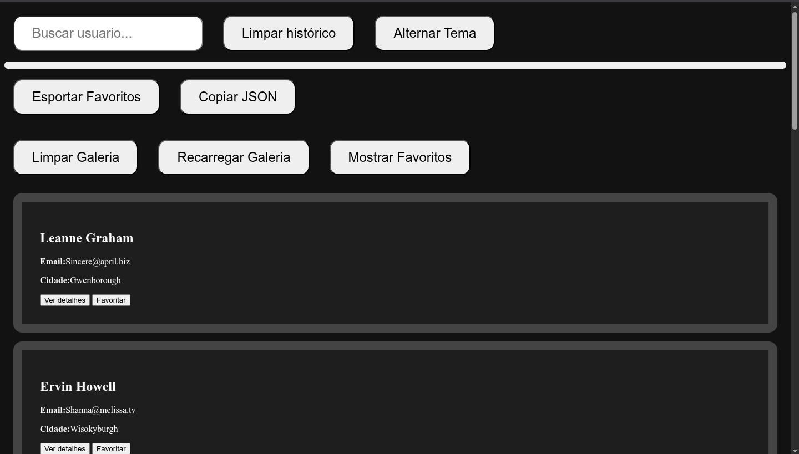

# Projeto Galeria De Usuários Com API

## Tudo Bem ? 👋

Eu sou [Arthur](https://drive.google.com/file/d/1DMee-tcR2M0huWUorfRSPmy2G5Rie5lZ/view?usp=sharing) desenvolvedor Frontend.

Brigado por olha meu código isso me ajuda muito a ter um bom retorno em meus projetos.

## Sobre o Projeto

Esse projeto fiz com auxílio de uma IA - Copilot da Microsoft.
O projeto tem como objetivo fazer uma galeria de dados sobre usuários de uma [API](https://jsonplaceholder.typicode.com/users). Sendo possível fazer uma busca por nomes dentro dela, além disso disponibilizo três botões para utilizar durante ou depois da pesquisa, dois deles ao lado da barra de busca e outro dentro do card, no entanto todos para testes, respectivamente;

- Limpar galeria
- Recarregar dados da API
- Mostrar detalhes do usuário

## Tecnologias Utilizadas

- HTML

- CSS

- JS

## Tranquilo ? 🤯

Se quiser experimentar dentro do site que o github disponibiliza fique a vontade e fique a vontade para baixar o projeto. Vou deixar disponivel para todos.

## 📸 Exibição



## 🧠 Aprendizados / Sobre

Bem vou falar sobre minha experiência antes e depois deste projeto.

Antes do projeto, tive dificuldades em algumas partes, mas a IA Copilot me ajudou bastante dividindo tudo em pequenos pedaços. Fiz vários mini-projetos até chegar neste resultado final.

Aprendi a usar `fetch`, manipular o DOM, trabalhar com eventos e aplicar lógica de filtragem — tudo com foco em JavaScript.

## 📬 Contato

Eu gosto muito de ouvir e ler opiniões que me ajudam a aprender e evoluir, então se você estiver algo para falar sobre, me envie mensagem por um desses links :

📱 : [**Instagram**](https://www.instagram.com/arthurcastro_99/)

💻 : [**Linkedin**](https://www.linkedin.com/in/arthur-castro-b70a02223/)

## 🛠️ Baixe na sua casa

1. Clone o repositório:

```bash
git clone https://github.com/seu-usuario/seu-repo.git
```
